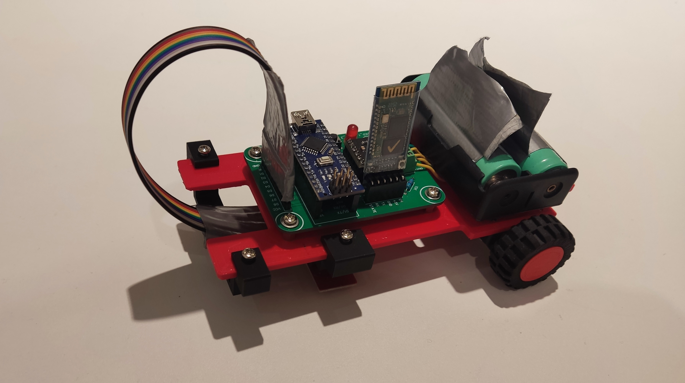

# LineFollower

Voor iedereen die een RC auto'tje wilt dat je niet hoeft/kan besturen.

  
## specifications

microcontroller: Arduino® Nano Every

motors: 6V Pololu micro metal gearmotors with gear ratio30:1

h-bridge: DRV8833 Dual H-Bridge Motor Driver

sensors: QTR-8A and QTR-8RC

batteries: li-ion

wireless communication: HC-05 -Bluetooth to Serial Port Module

distance sensor - motors: +-14cm

weight: <2kg

speed: low

